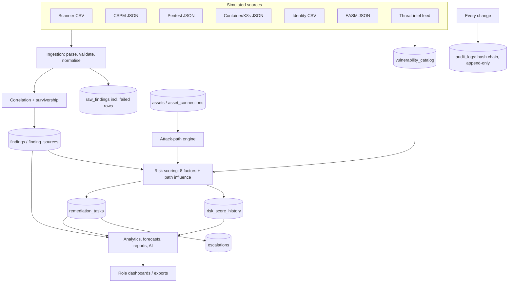

# Data flow

```mermaid
flowchart TB
  subgraph Sources[Simulated sources]
    S1[Scanner CSV] & S2[CSPM JSON] & S3[Pentest JSON] & S4[Container/K8s JSON] & S5[Identity CSV] & S6[EASM JSON] & S7[Threat-intel feed]
  end
  Sources --> I[Ingestion: parse, validate, normalise]
  I --> RAW[(raw_findings incl. failed rows)]
  I --> COR[Correlation + survivorship] --> F[(findings / finding_sources)]
  S7 --> CAT[(vulnerability_catalog)] --> SC
  F --> SC[Risk scoring: 8 factors + path influence] --> H[(risk_score_history)]
  G[(assets / asset_connections)] --> AP[Attack-path engine] --> SC
  SC --> T[(remediation_tasks)] --> ESC[(escalations)]
  F & T & H --> AN[Analytics, forecasts, reports, AI]
  AN --> UI[Role dashboards / exports]
  ALL[Every change] --> AUD[(audit_logs: hash chain, append-only)]
```
