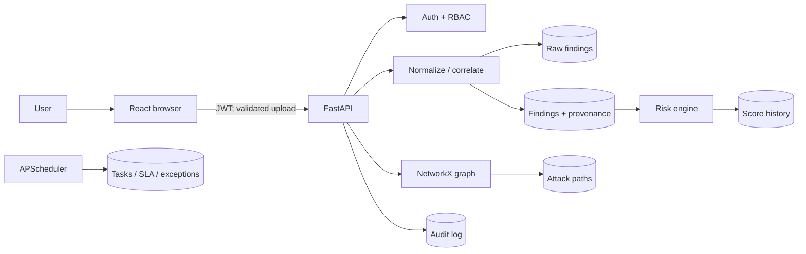

# Data-flow diagram

```mermaid
flowchart LR
  User --> Browser[React browser]
  Browser -->|JWT; validated upload| API[FastAPI]
  API --> Auth[Auth + RBAC]
  API --> Ingest[Normalize / correlate]
  Ingest --> Raw[(Raw findings)]
  Ingest --> Findings[(Findings + provenance)]
  Findings --> Risk[Risk engine]
  Risk --> History[(Score history)]
  API --> Graph[NetworkX graph]
  Graph --> Paths[(Attack paths)]
  Jobs[APScheduler] --> Tasks[(Tasks / SLA / exceptions)]
  API --> Audit[(Audit log)]
```
