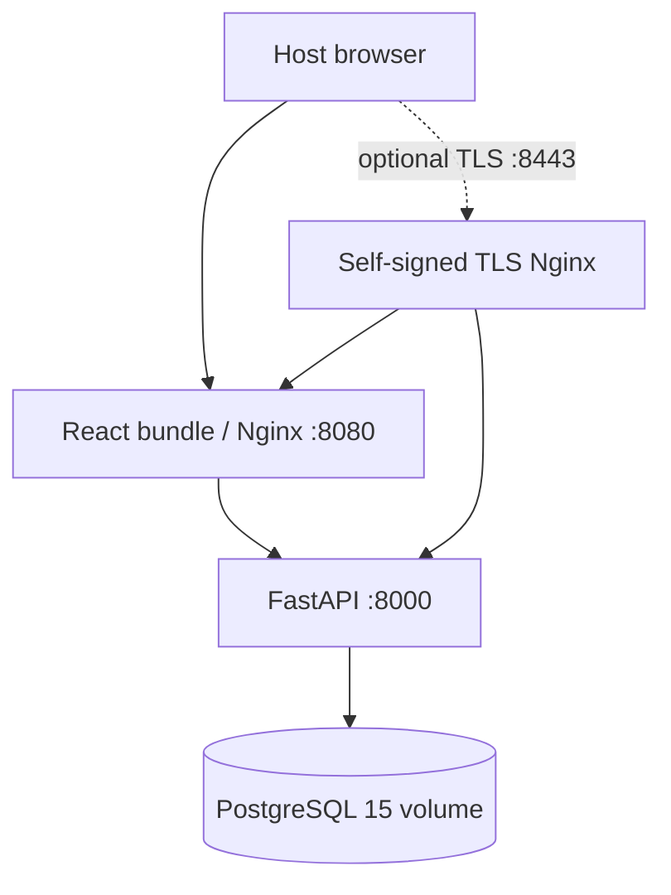

# Deployment diagram

```mermaid
flowchart TB
  HostBrowser[Host browser] --> Front[React bundle / Nginx :8080]
  HostBrowser -. optional TLS :8443 .-> Proxy[Self-signed TLS Nginx]
  Proxy --> Front
  Proxy --> API[FastAPI :8000]
  Front --> API
  API --> DB[(PostgreSQL 15 volume)]
```
