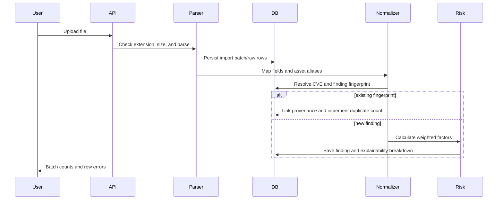

# Import and scoring sequence

```mermaid
sequenceDiagram
  User->>API: Upload file
  API->>Parser: Check extension, size, and parse
  Parser->>DB: Persist import batch/raw rows
  Parser->>Normalizer: Map fields and asset aliases
  Normalizer->>DB: Resolve CVE and finding fingerprint
  alt existing fingerprint
    Normalizer->>DB: Link provenance and increment duplicate count
  else new finding
    Normalizer->>Risk: Calculate weighted factors
    Risk->>DB: Save finding and explainability breakdown
  end
  API-->>User: Batch counts and row errors
```
