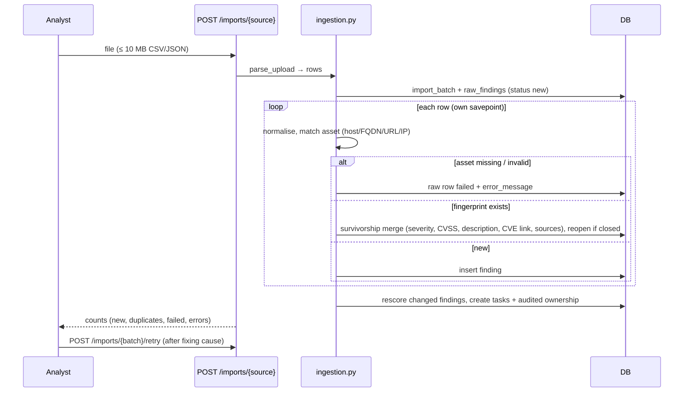

# Import sequence

```mermaid
sequenceDiagram
  participant A as Analyst
  participant API as POST /imports/{source}
  participant ING as ingestion.py
  participant DB
  A->>API: file (≤ 10 MB CSV/JSON)
  API->>ING: parse_upload → rows
  ING->>DB: import_batch + raw_findings (status new)
  loop each row (own savepoint)
    ING->>ING: normalise, match asset (host/FQDN/URL/IP)
    alt asset missing / invalid
      ING->>DB: raw row failed + error_message
    else fingerprint exists
      ING->>DB: survivorship merge (severity, CVSS, description, CVE link, sources), reopen if closed
    else new
      ING->>DB: insert finding
    end
  end
  ING->>DB: rescore changed findings, create tasks + audited ownership
  API-->>A: counts (new, duplicates, failed, errors)
  A->>API: POST /imports/{batch}/retry (after fixing cause)
```
